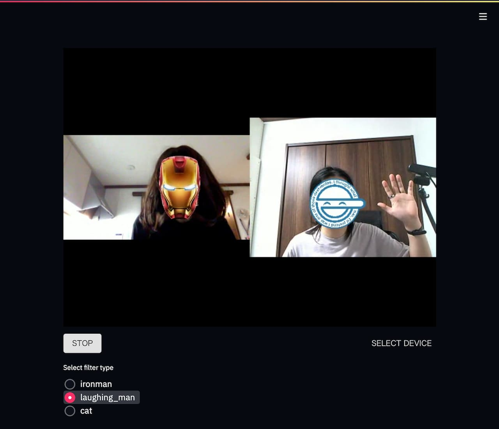

# streamlit-video-chat-example
Video chat examples based on Streamlit with [`streamlit-webrtc`](https://github.com/whitphx/streamlit-webrtc) and [`streamlit-server-state`](https://github.com/whitphx/streamlit-server-state).

[](https://github.com/whitphx/streamlit-video-chat-example/actions/workflows/tests.yml?query=branch%3Amain)


[](https://ko-fi.com/D1D2ERWFG)

<a href="https://www.buymeacoffee.com/whitphx" target="_blank"></a>

[](https://github.com/sponsors/whitphx)



## Try it out
```shell
$ pip install streamlit streamlit-webrtc streamlit-server-state opencv-python-headless
$ streamlit run https://raw.githubusercontent.com/whitphx/streamlit-video-chat-example/main/app_mcu_filters.py
```

This repository contains various implementations (`app_*.py`) while the example above uses `app_mcu_filters.py`.
